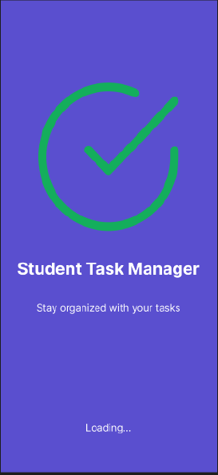
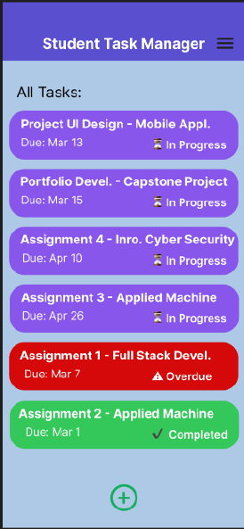
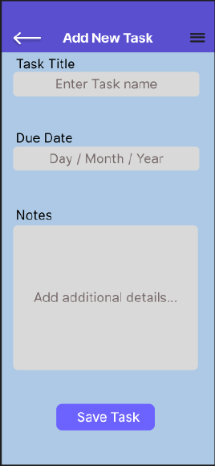
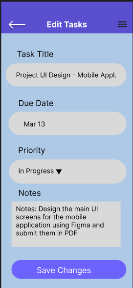
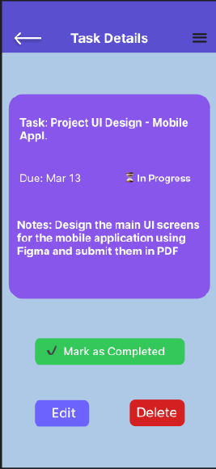
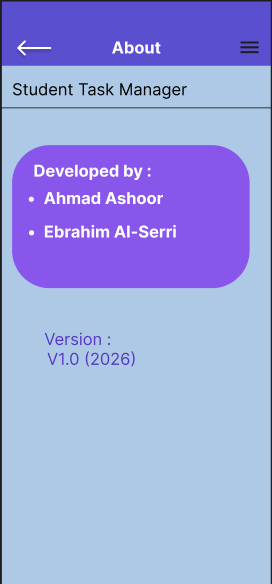

# Student Task Manager

A task management mobile application built with SwiftUI that helps users organize, manage, and track daily tasks through a clean and simple multi-screen interface.

---

## Features:
- Splash screen
- Task list screen
- Create new tasks
- Edit existing tasks
- Task details view
- Task status tracking
- About screen
- Multi-screen navigation
- Clean and simple mobile UI

---

## Tech Stack:
- Swift
- SwiftUI
- Xcode
- iOS Development

---

## Project Structure

```text
StudentTaskManager/
│
├── Screenshots/
│   ├── about_screen.png
│   ├── add_task_screen.png
│   ├── edit_tasks_screen.png
│   ├── home_screen.png
│   ├── splash_screen.png
│   └── task_details_screen.png
│
├── StudentTaskManager.xcodeproj/
│   ├── project.xcworkspace/
│   ├── xcuserdata/
│   └── project.pbxproj
│
├── StudentTaskManager/
│   ├── Assets.xcassets/
│   ├── AboutView.swift
│   ├── AddTaskView.swift
│   ├── ContentView.swift
│   ├── EditTaskView.swift
│   ├── HomeView.swift
│   ├── SplashView.swift
│   ├── StudentTaskManagerApp.swift
│   ├── Task.swift
│   └── TaskDetailsView.swift
│
├── .gitignore
└── README.md
```

---
## Screenshots

### Splash Screen


### Home Screen


### Add Task Screen


### Edit Task Screen


### Task Details Screen


### About Screen



---

## Collaboration

Developed as a collaborative mobile application project using Git and GitHub workflow.

### Contributors::
- Ahmad Ashoor
- Ebrahim Awdah

---

## Features Improvements:
- Task reminders and notifications
- Local database storage
- Dark mode support
- Task categories and filtering
- Cloud synchronization
- User authentication


---

## Author

### Ebrahim Al-Serri
Computer Programming & Analysis - Graduate 2026

George Brown College


